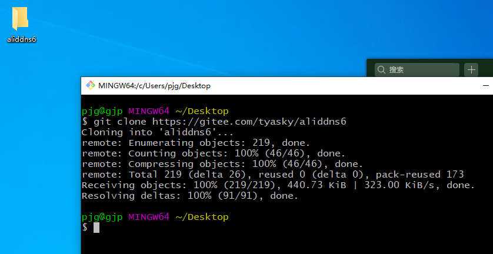
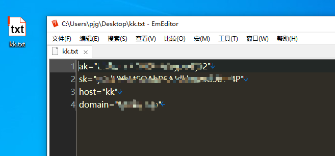
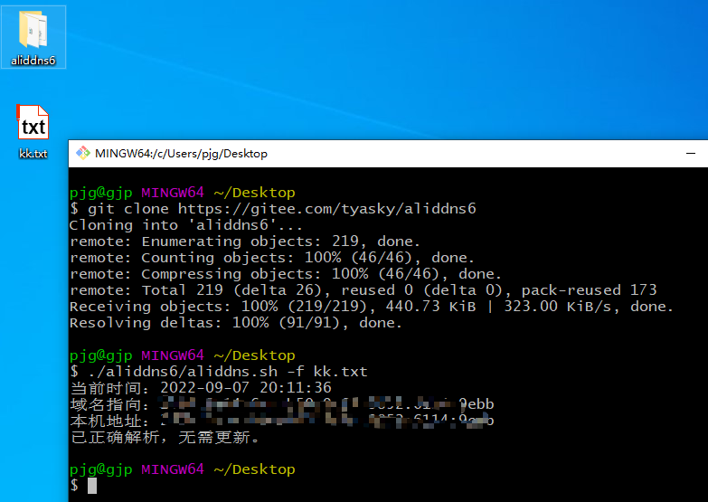
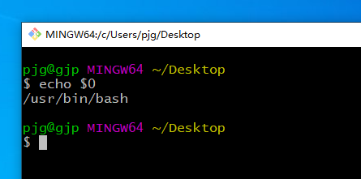
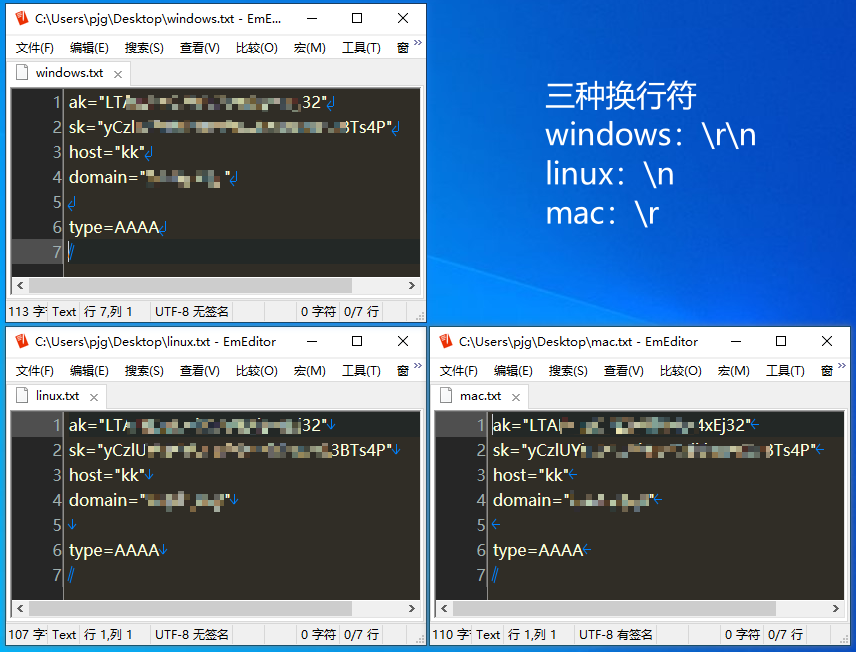
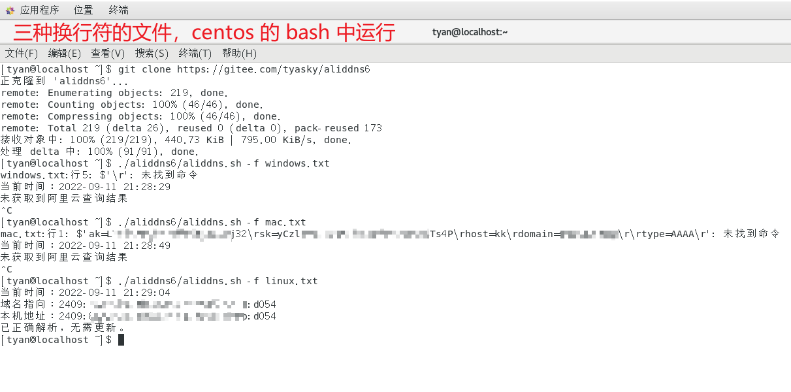
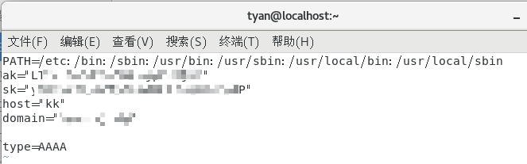

# aliddns.sh

此脚本将指定的域名和当前设备的公网 IP 地址一起提交给域名解析服务器，使外网设备可以通过域名访问当前设备。

脚本同时支持 IPv4 和 IPv6。没有公网 IPv4 地址，运营商已支持 IPv6，以下就以 IPv6 为例。

## 1、测试是否已接入 IPv6 网络

[IPv6 测试](http://www.test-ipv6.com/)，成功接入 IPv6 网络显示如下：


如果没接入 IPv6 网络，参考[中国电信IPv6地址获取教程](https://m.ithome.com/html/405571.htm)。

## 2、准备域名

去阿里云[万网](https://wanwang.aliyun.com/)购买一个域名。需要实名认证，购买域名时要填真实信息。

域名购买成功后，登录[阿里云](https://aliyun.com/)，进入控制台，[RAM 访问控制](https://ram.console.aliyun.com/overview)。用户 ➡️ 创建用户：


图中勾选了**编程访问**，会生成 **AccessKey ID** 和 **AccessKey Secret**：


为新加的用户添加权限 **AliyunDNSFullAccess**：


## 3、下载脚本

直接在用脚本的设备运行

```shell
git clone https://gitee.com/tyasky/aliddns6
```



## 4、编写配置

编辑一个配置文件 kk.txt

```shell
ak="Access Key ID"
sk="Access Key Secret"
host="kk"
domain="xx.com"
```



## 5、手动执行

```shell
./aliddns6/aliddns.sh -f kk.txt
```



## 6、自动运行

1. Windows

   双击运行 createSchTask.vbs，输入执行脚本的命令：

   ```shell
   D:\aliddns6\aliddns.sh -f D:\kk.txt
   ```

   **命令中的路径都为绝对路径，且路径中都不能有空格。**

2. Linux

   创建定时任务

   ```bash
   crontab -e
   ```

   最后边添加如下内容：

   ```
   */5 * * * * /path/to/aliddns.sh -f /path/to/kk.txt
   ```

   **命令中的路径都为绝对路径。**如上是每 5 分钟执行一次。
   
3. 华硕路由器梅林

   1. [安装 Entware](https://github.com/RMerl/asuswrt-merlin.ng/wiki/Entware)，然后安装 bash。

   2. 复制 aliddns.sh 到 /jffs/scripts/ 路径下，改名为 ddns-start。

      ```shell
      cp aliddns6/aliddns.sh /jffs/scripts/ddns-start
      ```

   3. 打开 ddns-start，配置好以下几行。

      ```shell
      ak="AccessKey ID"        # 阿里云 RAM 访问控制中创建用户时生成的
      sk="AccessKey Secret"    # 同上
      host="kk"                # 用来描述设备的任意字母数字字符串
      domain="xx.com"          # 你的域名
      ```

## 7、问题解决

1. 脚本报错，检查终端

   用命令 `whereis bash` 或 `echo $0` 确认系统中有没有 bash，没有则安装上。

   
   
1. 脚本运行报错，未获取到阿里云查询结果

   原因：跨系统传脚本文件会存在换行符不同导致运行报错的问题。

   解决：只在运行脚本的地方编辑脚本。

   

   

2. crontab 设置了计划任务，"没有" 自动执行

   原因： [crontab 没有加载 PATH 全部路径](https://blog.csdn.net/fsx2550553488/article/details/81020623)，脚本里的命令找不到。

   解决：在 kk.txt 第一行加上下面这句

   ```shell
   PATH=/etc:/bin:/sbin:/usr/bin:/usr/sbin:/usr/local/bin:/usr/local/sbin
   ```

   

3. 手动删除解析记录

   主域名是 xx.com，删除 test.xx.com 的解析记录

   ```shell
   ./aliddns.sh -f conf.txt -d test
   ```

## 9. 其他

1. [检查域名解析情况](https://zijian.aliyun.com/)。

2. [阿里云云解析 DNS API 文档](https://help.aliyun.com/document_detail/29738.html)。

3. 交流反馈扣扣群：585194793