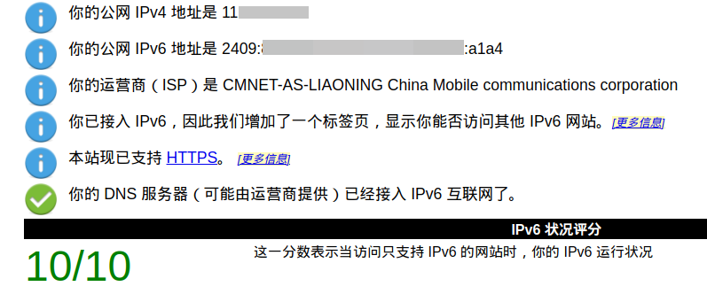
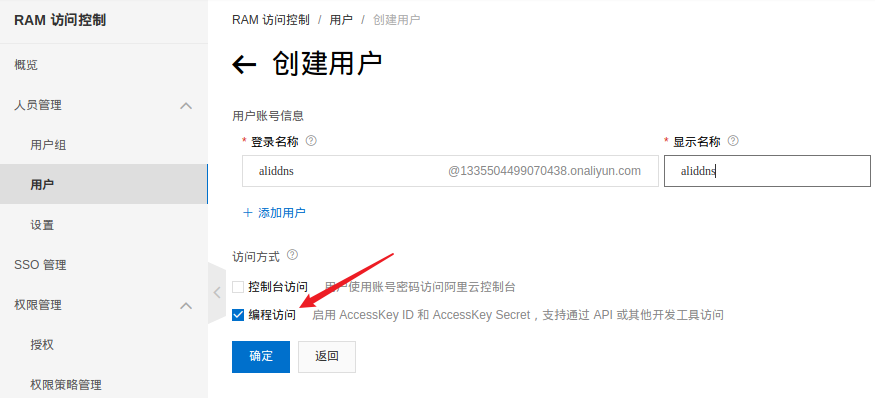
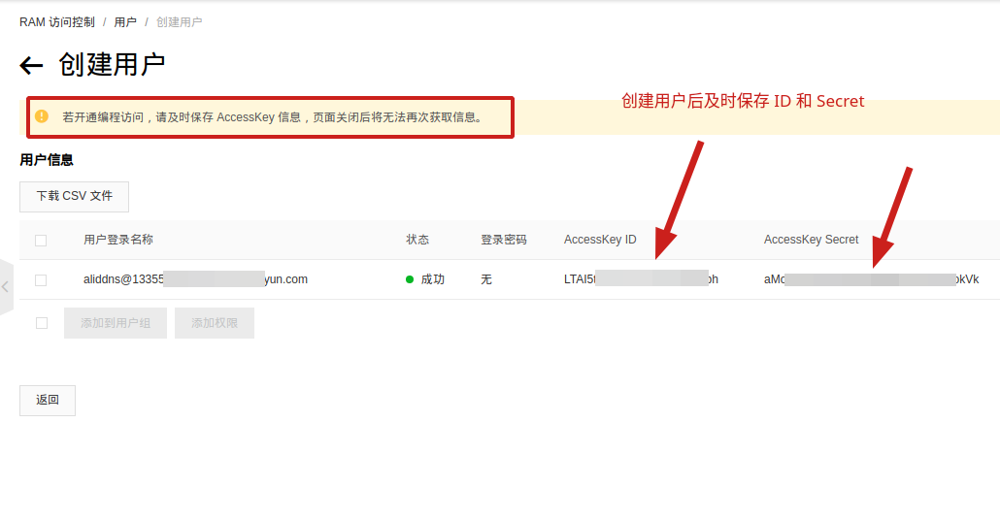
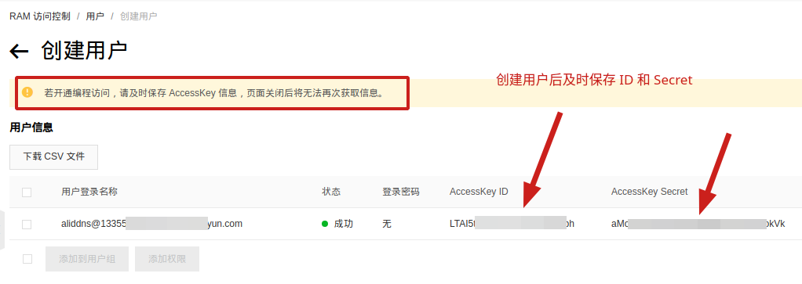

# aliddns.sh

此脚本将指定的域名和当前设备的公网 IP 地址一起提交给域名解析服务器，使外网设备可以通过域名访问当前设备。

脚本同时支持 IPv4 和 IPv6。没有公网 IPv4 地址，运营商已支持 IPv6，以下就以 IPv6 为例。

## 1. 测试是否已接入 IPv6 网络

当前设备有公网 IPv4 地址，且不想用 IPv6，可跳过此步。

[IPv6 测试](http://www.test-ipv6.com/)，成功接入 IPv6 网络显示如下：



如果没接入 IPv6 网络，参考[电信获取ipv6](https://m.ithome.com/html/405571.htm)。

## 2. 准备域名

去阿里云[万网](https://wanwang.aliyun.com/)购买一个域名。需要实名认证，购买域名时要填真实信息。

域名购买成功后，登录阿里云，进入控制台，[RAM 访问控制](https://ram.console.aliyun.com/overview)。用户 ➡️ 创建用户：



图中勾选了**编程访问**，会生成 **AccessKey ID** 和 **AccessKey Secret**：



为新加的用户添加权限 **AliyunDNSFullAccess**：



## 3. 下载脚本并配置

1. 下载 [Source code (zip)](https://gitee.com/tyasky/aliddns6/releases)。

2. 配置

    路由器用 ddns-start，其他平台用 aliddns.sh。

    前四行必改，后四行选改。在 Windows 下推荐用 [EditPlus](https://editplus.com/)  修改，不要用记事本。

    如果当前设备有公网 IPv4 地址，可将配置中的 type 设为 A。

    ```bash
    ak="AccessKey ID"             # 阿里云 RAM 访问控制中创建用户时生成的
    sk="AccessKey Secret"         # 同上
    host="ddns"                   # 字母数字构成的任意字符串
    domain="example.com"          # 你的域名
    
    runnum=10                     # 最多尝试更新次数
    rungap=60                     # 尝试间隔秒数
    type=AAAA                     # 解析记录类型
    downvalue=""                  # 解析值，留空则动态获取
    ```

## 4. 路由器中自动运行

下面的步骤在 Windows 下可用 [Git](https://git-scm.com/download/win) 的 bash 完成（安装完Git，在脚本所在目录中右键选择 Bash）。

假设路由器中已开启 SSH，端口号为 8022，路由器登录名为 Asus，路由器 IP 为 192.168.50.1。

1. 在脚本所在目录，上传脚本：

    ```bash
    scp -P8022 ./ddns-start Asus@192.168.50.1:/jffs/scripts/
    ```

2. ssh 进路由器，为脚本添加执行权限：

    ```bash
    chmod a+x /jffs/scripts/ddns-start
    ```

3. ssh 进路由器，手动执行脚本，看运行是否正常：

    ```bash
    /jffs/scripts/ddns-start
    ```

    正常则自动运行设置完毕，不正常可加扣扣群交流（本页最后）。

4. 路由器管理页面中，外部网络 ➡️ DDNS ➡️ 启用 DDNS 客户端，服务器选择 Custom，主机名称填入脚本配置中的 host 和 domain 构成的子域名，即 ddns.你的域名，应用本页面设置。

## 5. Windows7 中自动运行

1. 下载安装 [Git](https://git-scm.com/download/win)，提供一个脚本运行环境。
2. 双击脚本 createSchTask.vbs，创建计划任务，默认每 5 分钟执行一次。

## 6. Linux 中自动运行

1. 赋予脚本执行权限

    ```bash
    chmod a+x ./aliddns.sh
    ```

2. 创建定时任务

    ```bash
    crontab -e
    ```

    最后边添加如下内容：

    ```
    */5 * * * * /path/to/aliddns.sh
    ```

    **/path/to/aliddns.sh** 为脚本的绝对路径。如上是每 5 分钟执行一次。

## 7. 命令行运行

1. 指定配置文件运行

    有配置文件 conf.txt，内容如下（其实就是将 aliddns.sh 中的配置内容复制到新的文件）：

    ```bash
    ak="Access Key ID"
    sk="Access Key Secret"
    host="test"
    domain="example.com"
    ```
    
    可这样运行：
    
    ```bash
    ./aliddns.sh -f conf.txt
    ```
    
2. 删除解析记录

    主域名是 xx.com，删除 test.xx.com 的解析记录：

    ```bash
    ./aliddns.sh -f conf.txt -d test
    ```

3. 后台运行

    ```bash
    nohup ./aliddns.sh &
    ```

## 8. 其他

[检查域名解析情况](https://zijian.aliyun.com/)。

[阿里云云解析 DNS API 文档](https://help.aliyun.com/document_detail/29738.html)。

交流反馈扣扣群：585194793
