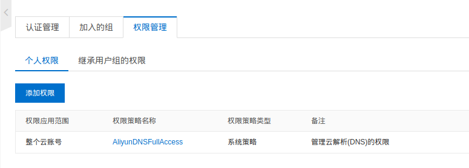

# 让 Aliddns 支持 IPv6

此处的离线包是在 [aliddns](https://github.com/kyriosli/koolshare-aliddns) （作者：[kyrios](https://koolshare.cn/space-uid-39292.html) ，[插件介绍](https://koolshare.cn/thread-64703-1-1.html)）基础上修改的，仅支持 IPv6。

## 1. 测试是否已接入 IPv6 网络

[IPv6 测试](http://www.test-ipv6.com/)，成功接入 IPv6 网络显示如下：

如果没接入 IPv6 网络，参考[电信获取ipv6](https://m.ithome.com/html/405571.htm)。

## 2. 准备域名

去阿里云[万网](https://wanwang.aliyun.com/)购买一个域名。需要实名认证，购买域名时要填真实信息。

域名购买成功后，登录阿里云，进入控制台，[RAM 访问控制](https://ram.console.aliyun.com/overview)。用户 ➡️ 创建用户：

图中勾选了**编程访问**，会生成 **AccessKey ID** 和 **AccessKey Secret**：

为新加的用户添加权限 **AliyunDNSFullAccess**：

## 3. 离线安装 Aliddns6

下载此处的离线安装包 [aliddns6.tar.gz](https://gitee.com/tyasky/aliddns6/blob/master/aliddns6.tar.gz)，到路由器软件中心离线安装。

## 4. Aliddns 设置面板

我的固件是梅林改 RT-AC86U_384.14，这是我的 Aliddns 设置界面:

域名：第一空填任意英文名字，第二空填域名

DNS 服务器和获取IP命令不用填。

提交。

## 5. 其他

[检查域名解析情况](https://zijian.aliyun.com/)。

[阿里云云解析 DNS API 文档](https://help.aliyun.com/document_detail/29740.html)。

